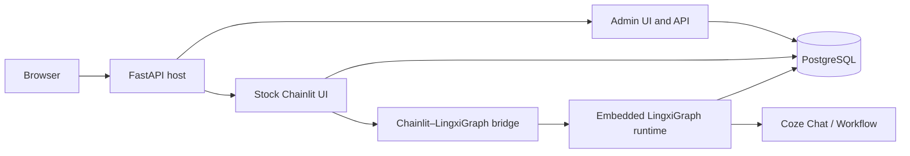

# LingxiNext

基于 [LingxiGraph](https://github.com/LingXi-Org/LingxiGraph) 与原生
[Chainlit](https://github.com/Chainlit/chainlit) 的安全多智能体编排平台。

LingxiNext 是 [Coze-Chainlit](https://github.com/LingXi-Org/Coze-Chainlit) 编排能力的
重新设计：使用 LingxiGraph 作为嵌入式运行时，直接加载 Chainlit 的 PyPI 前端，以不可变
revision、PostgreSQL checkpoint 和受约束图模板支撑可恢复的多智能体会话。

## 核心能力

- **原生 Chainlit**：聊天界面挂载在 `/`，不复制 Chainlit 源码，也不维护独立 React/Vite 前端。
- **嵌入式 LingxiGraph**：FastAPI、Chainlit、管理后台与图运行时处于同一进程，无需 Redis 或独立 Worker。
- **版本化编排**：草稿发布为不可变 revision；每个会话固定 revision，新发布不会改变历史会话行为。
- **可靠恢复**：Chainlit thread ID 映射到 graph `thread_id`，revision ID 作为 checkpoint namespace。
- **安全 Coze 集成**：支持 Coze Chat 与 Workflow，Service Token 加密存储、掩码返回且不会进入图状态。
- **轻量管理后台**：Jinja2、原生 JavaScript 与 SVG 节点画布，无 Node 构建链。
- **生产化部署**：应用以非 root、只读根文件系统运行，Compose 提供迁移门禁、健康检查和优雅终止。

## 架构



FastAPI 先注册 `/admin`、`/api/admin/*` 与 `/health/*`，最后通过 Chainlit 官方
`mount_chainlit(..., path="/")` 挂载聊天应用，避免 SPA catch-all 覆盖宿主路由。

## 安全图模板

| 模板 | 用途 | 主要约束 |
| --- | --- | --- |
| `topic_auction` | 根据关键词、topic、难度和连续性竞价路由 | 支持独占关键词；Workflow 只能作为终端 Agent |
| `supervisor` | Supervisor 调度多个 specialist | 校验 `next_agent`，限制轮次并提供确定性回退 |
| `handoff` | Agent 沿管理员允许的 peer 边转交 | 校验入口与目标，拒绝循环并限制最大跳数 |
| `parallel_review` | source 并行分发给 reviewer，再由 judge 汇总 | 强制 source → reviewer → judge 拓扑 |
| `plan_execute` | planner、executor、replanner 循环 | 限制迭代；Workflow 仅允许绑定 executor |

服务端会重新校验节点角色、Agent 类型、允许边、必需拓扑、循环、入口可达性和运行上限。
管理员不能上传 Python、任意 callable 或绕过模板创建自由图。

## Docker Compose 快速开始

要求 Docker Engine 与 Docker Compose v2。

```bash
git clone --recurse-submodules https://github.com/LingXi-Org/LingxiNext.git
cd LingxiNext
cp .env.example .env
```

编辑 `.env`，替换其中的全部占位值。至少需要三个互相独立的强随机密钥：

- `CHAINLIT_AUTH_SECRET`
- `LINGXI_MASTER_KEY`
- `POSTGRES_PASSWORD`

然后启动：

```bash
docker compose up --build -d
docker compose ps
```

默认入口：

- Chainlit：<http://localhost:8123>
- 管理后台：<http://localhost:8123/admin>
- Liveness：<http://localhost:8123/health/live>
- Readiness：<http://localhost:8123/health/ready>

首次启动会幂等创建 `.env` 中配置的管理员。登录后依次创建 Coze 连接、Agent 和编排方案，
校验并发布 revision；已启用的方案会自动成为 Chainlit Chat Profile。

## 本地开发

项目使用 [uv](https://docs.astral.sh/uv/) 管理依赖与锁文件。

```bash
git submodule update --init --recursive
uv sync --extra dev
uv run python -m app.migrations
uv run uvicorn app.main:app --reload
```

质量检查：

```bash
uv run ruff check app scripts tests
uv run ruff format --check app scripts tests
uv run mypy app
uv run pytest -q
docker build -t lingxinext:local .
```

## 同步上游

`vendor/LingxiGraph` 是跟踪 `main` 的 Git 子模块，父仓库始终提交确定的子模块 commit。
Chainlit 则锁定在经过契约测试的最新稳定版本。

```bash
python scripts/sync_upstreams.py --check
python scripts/sync_upstreams.py --apply
```

`--apply` 会更新 LingxiGraph 子模块指针、解析 Chainlit 最新稳定版本、刷新 `uv.lock`，并运行
格式、类型、单元、契约与 Docker 构建检查。脚本不会提交、推送或创建 Pull Request。

## 项目结构

```text
app/
  admin.py             管理页面、管理 API 与健康检查
  bridge.py            Chainlit 事件与 LingxiGraph 运行桥接
  chat.py              Chainlit 认证、数据层与 Chat Profile
  graph_templates.py   安全模板校验与编译器
  migrations.py        平台、Chainlit 与 checkpoint 初始化
  models.py            PostgreSQL 数据模型
scripts/
  sync_upstreams.py    手动上游同步与兼容性验证
tests/                 安全、模板和上游 API 契约测试
vendor/LingxiGraph/    固定 commit 的上游 Git 子模块
```

## 安全边界

- 首版是单租户部署，仅支持 Coze Bot 与 Coze Workflow。
- 不提供公开注册；平台用户由管理员管理，密码使用 Argon2 哈希。
- Coze Token 使用部署级主密钥加密，API 仅返回掩码。
- 管理写接口要求管理员会话和 CSRF Token，所有关键操作写入审计日志。
- 禁用文件上传、MCP、HTML 注入与公开线程分享。
- 不包含旧 SQLite 数据迁移，也不迁移练习、作业、错题或排行榜业务。

请勿将 `.env`、真实 Service Token 或生产数据库备份提交到仓库。安全问题请遵循组织的
[安全策略](https://github.com/LingXi-Org/.github/blob/main/SECURITY.md) 私下报告。

## 参与贡献

欢迎提交清晰的问题报告、设计讨论、文档改进与 Pull Request。开始前请阅读组织级
[贡献指南](https://github.com/LingXi-Org/.github/blob/main/CONTRIBUTING.md) 和本仓库现有 Issue。

LingxiNext 仍在快速演进。更新 LingxiGraph 或 Chainlit 后，请同时提交锁文件、子模块指针和
兼容性测试结果。
