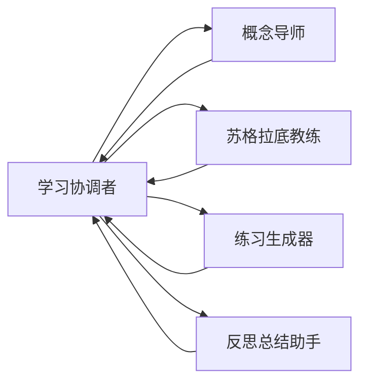
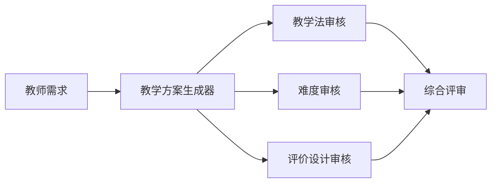

# 教师端与学生端多智能体场景

LingxiNext 在现有安全模板上提供两个教育预设。预设不会创建自由图，也不会保存 Coze Token 或写死 Agent ID；管理员必须把已有的启用 Coze Chat Agent 映射到每个业务角色，生成的草稿仍需通过标准校验和发布流程。

## 角色与访问范围

平台支持 `admin`、`teacher`、`student`、`user` 四种角色：

| 角色 | 可见编排 |
| --- | --- |
| `admin` | 全部已启用、已发布编排 |
| `teacher` | `audience_roles` 含 `teacher` 的编排 |
| `student` | `audience_roles` 含 `student` 的编排 |
| `user` | `audience_roles` 含 `user` 的公共编排 |

`audience_roles` 与 `scenario_key` 都保存于草稿和不可变 revision 配置中。草稿修改只有在再次发布后才影响新会话；旧 revision 没有 `audience_roles` 时按公共编排兼容。未知角色和格式错误的受众配置默认拒绝。

## 学生个性化学习伙伴

- 场景键：`student_learning_companion`
- 模板：`supervisor`
- 受众：`student`
- 默认最大轮次：6



平台会在调用学习协调者时注入路由协议。协调者必须在回复末尾输出严格 JSON：

```json
{"next_agent":"concept_tutor"}
```

合法目标为 `concept_tutor`、`socratic_coach`、`practice_coach`、`reflection_coach` 和 `__end__`。达到最大轮次或返回 `__end__` 时结束；非法目标由运行时执行确定性回退。每个 specialist 的业务职责也由预设写入节点 `config.instructions` 并在调用时作为系统说明注入。

## 教师教学方案生成与多维审核

- 场景键：`teacher_lesson_review`
- 模板：`parallel_review`
- 受众：`teacher`



`source` 生成初稿后，LingxiGraph 使用 `Send` 将初稿并行分发给三个 reviewer；`reviews` reducer 合并结果，再由 `judge` 输出最终教学方案。所有角色必须绑定 `coze_chat`，Workflow 会在场景创建或标准模板校验阶段被拒绝。

## 创建与发布

1. 在管理后台创建 Coze 连接，并注册至少一个启用的 Coze Chat Agent。
2. 进入“智能体编排”，选择“新建编排”。
3. 选择学生或教师教育场景。
4. 为每个业务角色选择已有 Agent；同一 Agent 可以在试用阶段承担多个角色。
5. 创建后在画布检查自动生成的节点、布局、必需边和受众范围。
6. 运行“校验”，确认通过后发布不可变 revision。
7. 创建相应角色的平台账号并登录验证 Chat Profile。

管理 API：

```text
GET  /api/admin/education/scenarios
POST /api/admin/orchestrations/from-scenario
```

创建请求示例：

```json
{
  "scenario_key": "student_learning_companion",
  "slug": "student-companion",
  "name": "学生个性化学习伙伴",
  "agent_mapping": {
    "student_supervisor": "00000000-0000-0000-0000-000000000001",
    "concept_tutor": "00000000-0000-0000-0000-000000000002",
    "socratic_coach": "00000000-0000-0000-0000-000000000003",
    "practice_coach": "00000000-0000-0000-0000-000000000004",
    "reflection_coach": "00000000-0000-0000-0000-000000000005"
  }
}
```

## 演示流程

学生账号登录后只会看到学生专属与公共编排。可先提问一个知识点，再要求循序提示、生成练习和总结误区，观察 supervisor 的角色分派。

教师账号登录后只会看到教师专属与公共编排。输入学段、学科、课时和课程目标后，观察初稿生成、三个评审并行运行以及综合评审输出最终教学设计。

## 当前限制

- 教育预设仅使用 Coze Chat Agent；
- 首版不包含课程、班级、作业、提交、测验或学习记录模型；
- 首版不包含教师人工审批和 `interrupt/resume`；
- Chat Profile 隐藏不是安全边界，服务端会在新会话绑定前再次授权；
- 已绑定 thread 始终固定到原 revision，不因受众草稿修改或新发布而迁移。
